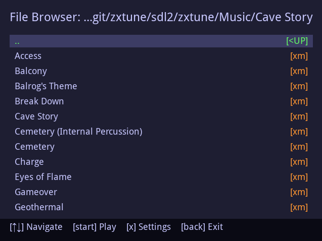
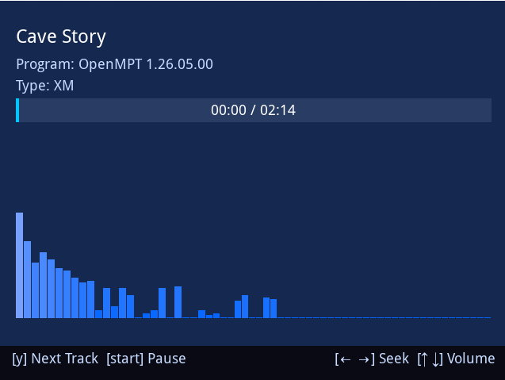
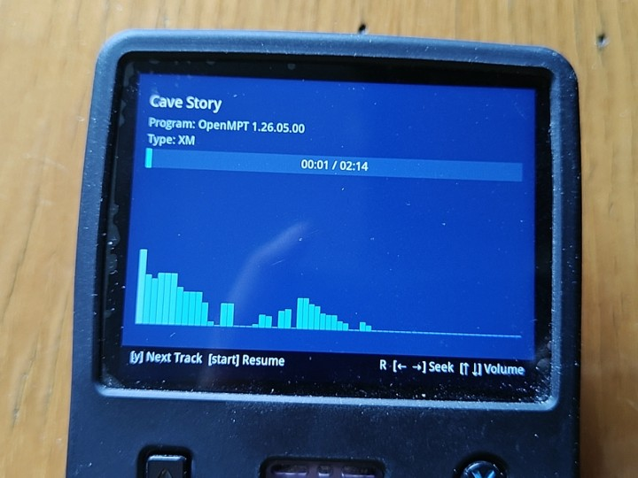

# ZXTune SDL2 Player (Open-Source Handheld Console Edition)

[English](README.md) | [中文](README_ZH.md)

A lightweight SDL2 music player based on ZXTune, designed specifically for open-source retro handheld consoles.

This project provides an SDL2 graphical frontend for **zxtune123**, allow users to browse & play a wide range of chiptune, classic console/computer game audio and regular waveform files via keyboard or gamepad.

> **System Compatibility Note (Tested with R36S and Desktop environments, using ALSA audio backend):**
> - ✅ **ArkOS** - Fully supported
> - ✅ **dArkOS** - Fully supported
> - ✅ **Desktop (kubuntu 26.04 LTS)** - Fully supported 
> - ⚠️ **Other Systems** - Untested

> If the program fails to run, please first check the error log at `./zxtune/log.txt`. If the log does not provide useful information, try modifying the launch script `zx_sdl2.sh` by imitating other PortMaster games on your system. Feedback on compatibility with other systems is also welcome!

---

## Features

- SDL2-based graphical music browser
- Gamepad-friendly UI design
- Real-time spectrum analyzer (thanks to the powerful `zxtune123` backend)
- Multi-language support (external language files)
- Adjustable UI refresh rate, seek step, and spectrum band count
- Lightweight, perfect for low-power handheld CPUs

---

## Screenshots

### Software Interface

| File Browser | Playback Screen |
| ---- | ---- |
|  |  |
| *ZXTune SDL2 File Browser* | *ZXTune SDL2 Playback Screen* |

### Real Hardware



---

## Supported Music Formats (Provided by the versatile zxtune123)

ZXTune natively decodes a wide range of music formats, with a strong focus on classic console and computer game audio. It supports numerous formats that general-purpose players often cannot handle, including but not limited to:

- NSF (NES)
- SPC (SNES)
- VGM / VGZ
- PSF
- GSF / miniGSF
- 2SF / mini2SF
- MOD / XM / S3M
- Various other tracker and chiptune formats
- MP3, FLAC, and other standard waveform audio files
- For a complete list of supported formats, please visit [Supported Features](https://zxtune.bitbucket.io/info/features/)

---

## Controls

Default controls for the SDL2 interface:

| Keyboard | Gamepad | Function |
|----|----|----|
| Arrow Keys | D-Pad | Navigate / Adjust |
| Enter | A / Start | Play / Confirm |
| Space | Y | Next Track |
| R | R2 | Toggle Loop |
| PgDown | R1 | Next Page |
| PgUP| L1 | Previous Page |
| Q | B | Go Back |
| S | X | Settings |
| Esc | Back / Select | Exit |

* Note: The Next Track button (Space / Y) only switches built-in multitracks of the currently loaded audio instead of playing the next audio file in the folder. Sequential playback will be available in a future update.

*Controls may vary depending on your `gptokeyb` configuration. You can modify the gamepad mapping at any time by editing the `zxtune.gptk` file.*

---

## Installation

### Installing on Handhelds (e.g., ArkOS/dArkOS)

To install and run ZXTune SDL2 ver on your handheld device, follow these steps to copy the required files:

**Prepare your SD card:**
1. Power off your handheld.
2. Remove the MicroSD card and insert it into your PC.

**Copy the files:**
1. Open the `EASYROMS` partition on your SD card.
2. Navigate to the `ports` folder (create it if it doesn't exist).
3. Extract the [Releases](https://github.com/BCTaoTao/zxtune-sdl2-handheld/releases) archive and copy the contents of the resulting folder to `EASYROMS/ports/`.
> **Important:** Ensure the internal directory structure is preserved. It should look like this:

```text
📂 EASYROMS/ports/
├── 🚀 zx_sdl2.sh             # Launch script
├── 📁 zxtune/                # Main application folder
│   ├── 📁 LANG/              # Language translation files
│   ├── 📚 lib/               # Required libraries (Leave empty if none needed)
│   ├── 📁 LICENSES           # License files
│   ├── 🎵 Music/             # Folder for your music files
│   ├── 🖥️ zxtune_sdl2        # SDL2 frontend binary
│   ├── ⚙️ zxtune123          # Backend player binary
│   ├── 🎮 zxtune.gptk        # Gamepad key mapping configuration
└── Other Ports files......
```

Once copied, open the **Ports** section in the EmulationStation main menu and launch `zx_sdl2` to start browsing the `zxtune/Music` directory.

`zxtune123` will handle the playback, while the SDL2 interface provides navigation and spectrum visualization.

---

## Compiling using Chroot + QEMU User-Mode Emulation

> **🚀 Most users don't need to compile!**  
> Just download the pre-built version from [Releases](https://github.com/BCTaoTao/zxtune-sdl2-handheld/releases) and follow the installation steps above.  
>
> **Only when you encounter a system error about `glibc` version being too low** should you consider compiling it yourself.
>- When compiling, you can use an older rootfs, or directly use the device's native rootfs.
>
> **If other `.so` libraries are missing**, try downloading the corresponding files and place them into `./zxtune/lib/`.

---

This project recommends using **chroot** combined with **qemu-user** emulation to compile both the backend and frontend in an ARM64 environment provided by `ubuntu-20.04-server-cloudimg-arm64-root`.

### Prerequisites

Before you begin, ensure the following tools are installed on your host system:

* qemu-user-static
* binfmt-support

On Debian/Ubuntu-based systems:

```bash
sudo apt install qemu-user-static binfmt-support
```

### Setup and Build Steps

#### Compiling the zxtune123 Backend

1. **Download and extract the Ubuntu 20.04 ARM64 rootfs:**

   Find a memorable directory,download the Ubuntu 20.04 ARM64 rootfs and extract it to the current directory:

   ```bash
   wget https://cloud-images.ubuntu.com/releases/focal/release/ubuntu-20.04-server-cloudimg-arm64-root.tar.xz
   mkdir -p ubuntu-20.04-arm64
   tar -xvf ubuntu-20.04-server-cloudimg-arm64-root.tar.xz -C ubuntu-20.04-arm64
   ```

2. **Enter the Chroot environment:**

   Navigate into the extracted directory and chroot:

   ```bash
   cd ubuntu-20.04-arm64
   sudo mount -o bind /tmp ./tmp
   sudo mount --rbind /dev ./dev
   sudo mount -t proc /proc ./proc
   sudo chroot ./ /bin/bash
   ```

   > **<span style="color:red">IMPORTANT: All subsequent steps must be executed INSIDE the chroot environment!</span>**

3. **Install build dependencies (inside chroot):**

   Once inside the chroot environment, install the required packages:

   ```bash
   apt update
   rm /etc/resolv.conf && echo "nameserver 8.8.8.8" > /etc/resolv.conf
   apt install build-essential g++-10 libboost-program-options-dev libpulse-dev libasound2-dev libsdl2-dev libsdl2-ttf-dev
   ```

4. **Configure GCC alternatives:**

   Set g++-10 as the default compiler:

   ```bash
   update-alternatives --install /usr/bin/g++ g++ /usr/bin/g++-10 100
   ```

5. **Clone and compile the backend (zxtune123):**

   Inside the chroot environment:

   ```bash
   cd ~
   git clone -b master https://github.com/BCTaoTao/zxtune-sdl2-handheld.git
   make boost.force_static=1 platform=linux -j$(nproc)
   ```

   Once compiled, the `zxtune123` binary will be generated in `./bin/linux/release/`.

---

#### Compiling the SDL2 Frontend

The SDL2 frontend provides the graphical interface for browsing and playing music. It communicates with the `zxtune123` backend via pipes.

Continue navigating to the `./sdl2` directory under the project root:

```bash
cd ../../sdl2/
make
```

Once compiled, the `zxtune_sdl2` binary will be generated in the `./zxtune` folder.

#### Assembling the Files

Move the previously compiled `zxtune123` binary into the `./zxtune` folder as well:

```bash
mv ../bin/linux/release/zxtune123 ./zxtune
```

The compilation phase is complete! You can now copy the folder, along with the launch script, to `EASYROMS/ports` following the directory structure described earlier.

#### Finishing Up (Exiting Chroot)

Exit the chroot environment:
> **<span style="color:red">IMPORTANT: Do not forget to unmount the directories!</span>**

```bash
exit
sudo umount -l ./dev
sudo umount -l ./tmp
sudo umount -l ./proc
```

---

### 🚧 WIP (Work in Progress)
- [ ] Code refactor: Split long code and wrap into standalone functions
- [ ] New feature: Support sequential playback of media files by folder, replace single-file multi-track only mode
- [ ] Use native gamepad event handling instead of GPTK

---

## Credits & Third-Party Resources

This project is a derivative development based on the upstream ZXTune project.

- **[ZXTune](https://github.com/vitamin-caig/zxtune)**: The core playback engine. All audio decoding and format parsing features are credited to the ZXTune development team. (Licensed under LGPLv3)

This project also incorporates the following excellent open-source projects and resources:

- **[SDL2 & SDL2_ttf](https://www.libsdl.org/)**: Provides cross-platform graphics, font rendering, and input support. (Licensed under zlib License)
- **[Boost](https://www.boost.org/)**: Provides basic C++ library support for the backend (requires static linking to adapt for open-source handhelds). (Licensed under BSL-1.0)
- **[WenQuanYi Micro Hei](http://wenq.org/)**: The font included in the release package. (Licensed under Apache License 2.0)
---

## License

This fork is based on the upstream ZXTune source code and is licensed under the **GNU LGPL v3** License.

Copyright (C) 2026 BCTaoTao. (SDL2 Frontend & modifications adapted for retro handhelds)

> **Note on modifications to the original backend:**
>
> To adapt to ArkOS/dArkOS, resolve audio output issues in specific environments, and optimize frontend-backend communication, necessary modifications were made to the original zxtune backend.
> 
> To keep the upstream code clean, inline comments were not added for these backend modifications. For full details of the changes, please refer to the [Git Commit History](https://github.com/BCTaoTao/zxtune-sdl2-handheld/commits/master) of this repository. Major changes include:
> - Simplified ALSA detection logic
> - Added new data transfer methods: `--output-fd arg` and `--output-format arg`
> - Added a parameter to adjust the number of spectrum bars: `--spectrum-size arg`

---

# Original ZXTune README

```
# ZXTune

ZXTune is open-source crossplatform chiptunes player.

Official page is [https://zxtune.bitbucket.io](https://zxtune.bitbucket.io)
```
