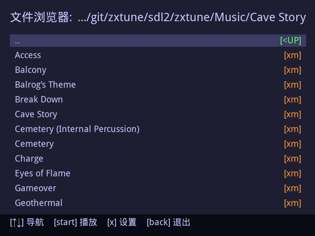
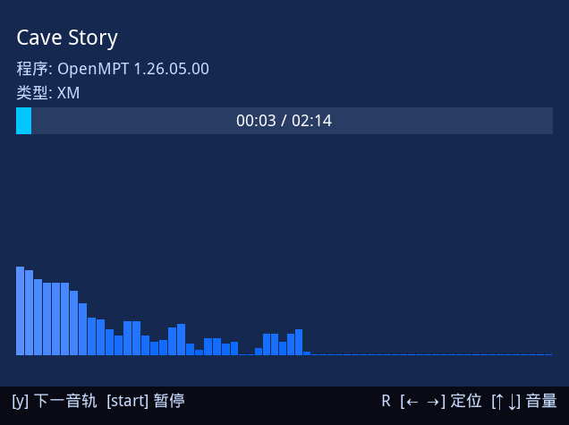
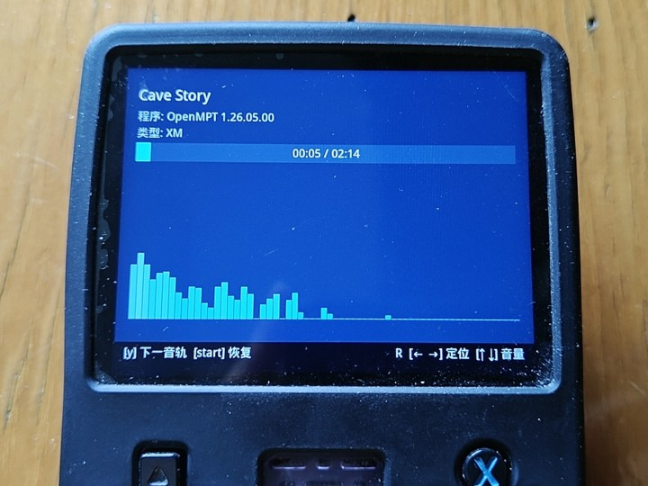

# ZXTune SDL2 播放器 (开源掌机版本)

[English](README.md) | [中文](README_ZH.md)

一款基于 ZXTune 的轻量级 SDL2 音乐播放器，专为复古开源掌机设计。

本项目为 **zxtune123** 提供了一个 SDL2 图形界面前端，允许用户使用游戏手柄或键盘浏览和播放绝大多数芯片音乐、经典游戏机和电脑游戏的音频以及常规波形音频文件。

> **系统兼容性说明（使用R36S与桌面设备测试, 使用 ALSA 音频后端）：**
> - ✅ **ArkOS** - 完全支持
> - ✅ **dArkOS** - 完全支持
> - ✅ **桌面端（kubuntu 26.04 LTS）** - 完全支持 
> - ⚠️ **其他系统** - 未测试

> 如果无法运行，请先查看 `./zxtune/log.txt` 的错误日志；如果日志没有提供有效信息，再尝试参考您系统上其他 PortMaster 游戏修改启动脚本 `zx_sdl2.sh` 。也欢迎反馈在其他系统上的兼容性情况！
---

## 功能特性

- 基于 SDL2 的图形化音乐浏览器
- 对手柄友好的界面设计
- 实时频谱分析（归功于 zxtune123 强大的能力）
- 多语言支持（外置语言文件）
- 可调节的界面刷新率、快进步长和频谱柱数量
- 轻量级，适合低功耗掌机 CPU

---

## 截图展示

### 软件界面

| 文件浏览界面 | 播放界面 |
| ---- | ---- |
|  |  |
| *ZXTune SDL2的文件浏览界面* | *ZXTune SDL2的播放界面* |


### 实机照片



---

## 支持的音乐格式（由万金油zxtune123提供）

ZXTune原生支持多种音乐格式解码，尤其专注于经典游戏机和电脑游戏的音频。它支持许多通用播放器通常无法处理的格式，包括但不限于：

- NSF (NES)
- SPC (SNES)
- VGM / VGZ
- PSF
- GSF / miniGSF
- 2SF / mini2SF
- MOD / XM / S3M
- 以及其他多种 tracker 和芯片音乐格式
- MP3、FLAC等常规波形文件
- 更多支持的格式请访问[支持的功能](https://zxtune.bitbucket.io/info/features/)
---

## 操作说明

SDL2 界面的默认控制：

| 键盘 | 手柄 | 功能 |
|----|----|----|
| 方向键 | D-Pad | 导航/调节 |
| Enter | A / Start | 播放/确认 |
| Space | Y | 下一音轨 |
| R | R2 | 循环播放 |
| PgDown | R1 | 向下翻页 |
| PgUP| L1 | 向上翻页 |
| Q | B | 返回 |
| S | X | 设置 |
| Esc | Back | 退出 |

* 注释：下一音轨按钮（Space / Y）仅用来切换当前已加载音频的内置多音轨，而非跳转播放文件夹内的下一个音频；顺序播放功能将在后续版本上线。

控制方式可能因您的 gptokeyb 配置而有所不同，您可以随时通过更改 `zxtune.gptk` 文件来修改手柄映射。

---

## 使用方法

### 在掌机上安装（以ArkOS/dArkOS为例）

要在您的掌机设备上安装和运行 ZXTune SDL2 版本，请按照以下步骤复制所需的目录结构：

**准备 SD 卡：**
1. 关闭掌机电源
2. 取出 MicroSD 卡并插入电脑

**复制文件：**
1. 打开 SD 卡上的 `EASYROMS` 分区
2. 导航到 ports 文件夹（如不存在则创建）
3. 下载并解压 [Releases](https://github.com/BCTaoTao/zxtune-sdl2-handheld/releases) 中的压缩包，将得到的文件夹的内容复制到 `EASYROMS/ports/`
> 重要：确保保留内部结构，应该如下所示：

```
📂 EASYROMS/ports/
├── 🚀 zx_sdl2.sh             # 启动脚本
├── 📁 zxtune/                # 主应用程序文件夹
│   ├── 📁 LANG/              # 语言翻译文件夹
│   ├── 📚 lib/               # 所需库文件（若不缺，留空即可）
│   ├── 📁 LICENSES           # 许可证文件夹
│   ├── 🎵 Music/             # 音乐文件夹
│   ├── 🖥️ zxtune_sdl2        # SDL2 前端二进制文件
│   ├── ⚙️ zxtune123          # 后端播放器二进制文件
│   ├── 🎮 zxtune.gptk        # 游戏手柄按键映射配置
└── 其他Ports文件......
```

复制完成后，在 EmulationStation 主页面打开 Ports 分类，打开 zx_sdl2 即可开始浏览 `zxtune/Music` 目录。

ZXTune123 将处理播放，同时界面提供导航和频谱可视化功能。

---

## 使用 Chroot + QEMU 用户模式模拟进行编译

> **🚀 大多数用户无需编译！**  
> 请直接前往 [Releases](https://github.com/BCTaoTao/zxtune-sdl2-handheld/releases) 页面下载预编译版本，并按上文步骤安装即可。  
>  
> **仅当出现系统 `glibc` 版本过低的报错时**，才需要考虑自行编译。  
> - 编译时可选用**低版本 rootfs**，或直接使用**掌机原生 rootfs**。  
>  
> **若提示找不到其他 `.so` 库**，可尝试单独下载对应的 `.so` 文件，并将其放入 `./zxtune/lib/` 目录中。

---

本项目推荐使用 **chroot** 配合 **qemu-user** 模拟，在 `ubuntu-20.04-server-cloudimg-arm64-root` 提供的ARM64环境中编译后端和前端。

### 前置要求

开始前，请确保您的主机系统已安装以下工具：

* qemu-user-static
* binfmt-support

在 Debian 系系统上：

```bash
sudo apt install qemu-user-static binfmt-support
```

### 设置和编译步骤

#### 编译zxtune123后端

1. **下载并解压 Ubuntu 20.04 ARM64 rootfs：**

   找一个方便记忆的目录，下载 Ubuntu 20.04 ARM64 rootfs 并解压到当前目录：

   ```bash
   wget https://cloud-images.ubuntu.com/releases/focal/release/ubuntu-20.04-server-cloudimg-arm64-root.tar.xz
   mkdir -p ubuntu-20.04-arm64
   tar -xvf ubuntu-20.04-server-cloudimg-arm64-root.tar.xz -C ubuntu-20.04-arm64
   ```

2. **进入 Chroot 环境：**

   进入解压后的目录并直接 chroot：

   ```bash
   cd ubuntu-20.04-arm64
   sudo mount -o bind /tmp ./tmp
   sudo mount --rbind /dev ./dev
   sudo mount -t proc /proc ./proc
   sudo chroot ./ /bin/bash
   ```

   > **<span style="color:red">重要：后续操作请务必在chroot环境中执行！</span>**

3. **安装编译依赖（在 chroot 内）：**

   进入 chroot 环境后，安装所需的软件包：

   ```bash
   apt update
   rm /etc/resolv.conf && echo "nameserver 8.8.8.8" > /etc/resolv.conf
   apt install build-essential g++-10 libboost-program-options-dev libpulse-dev libasound2-dev libsdl2-dev libsdl2-ttf-dev
   ```

4. **配置 GCC 替代方案：**

   设置 g++-10 为默认编译器：

   ```bash
   update-alternatives --install /usr/bin/g++ g++ /usr/bin/g++-10 100
   ```

5. **克隆并编译后端（zxtune123）：**

   在 chroot 环境内：

   ```bash
   cd ~
   git clone -b master https://github.com/BCTaoTao/zxtune-sdl2-handheld.git
   cd zxtune-arkos
   make boost.force_static=1 platform=linux -j$(nproc)
   ```

   编译完成后，`zxtune123` 二进制文件将在源码目录 `./bin/linux/release/` 中生成。

---

#### 编译 SDL2 前端

SDL2 前端提供浏览和播放音乐的图形界面。它通过管道与 `zxtune123` 后端通信。

继续前往项目根目录的 `./sdl2` 目录：

```bash
cd ../../sdl2/
make
```

编译完成后，`zxtune_sdl2` 二进制文件将在./zxtune中生成。

#### 整合文件

将先前编译的zxtune123程序也移动到./zxtune中

```bash
mv ../bin/linux/release/zxtune123 ./zxtune
```

编译阶段完成，可以将文件夹连带启动脚本按照先前的目录结构说明复制到 `EASYROMS/ports` 了！

#### 完成 Chroot

退出 chroot 环境：
> **<span style="color:red">重要：不要忘记umount解绑操作！</span>**

```bash
exit
sudo umount -l ./dev
sudo umount -l ./tmp
sudo umount -l ./proc
```

---

## 🚧 WIP (开发进行中)
- [ ] 代码重构：拆分长代码，封装为独立函数
- [ ] 新增功能：支持按文件夹顺序播放媒体，告别仅单文件多音轨播放
- [ ] 使用原生手柄事件监听而非使用GPTK

---

## 致谢与第三方资源

本项目基于上游 ZXTune 项目二次开发：

- **[ZXTune](https://github.com/vitamin-caig/zxtune)**：核心播放引擎，播放器所有核心功能与格式解析均归功于 ZXTune 开发团队。（遵循 LGPLv3 许可证）

本项目也使用了以下优秀的开源项目及资源：

- **[SDL2 & SDL2_ttf](https://www.libsdl.org/)**：提供跨平台底层图形、字体渲染与按键输入支持。（遵循 zlib 许可证）
- **[Boost](https://www.boost.org/)**：为后端提供基础 C++ 库支持（需要静态链接适配开源掌机）。（遵循 BSL-1.0 许可证）
- **[文泉驿微米黑 (WenQuanYi Micro Hei)](http://wenq.org/)**：Release 发布包中内置的字体。（遵循 Apache 2.0 许可证）

---

## 许可证

本分支基于上游 ZXTune 源码二次开发，遵循 LGPL v3 许可证。

Copyright (C) 2026 BCTaoTao. （SDL2 前端及修改适配复古掌机的代码）
> **关于原版后端的修改说明：**
>
> 为适配 ArkOS/dArkOS、解决特定环境下的音频输出问题，以及优化前后端通信，本项目对原版 zxtune 后端进行了必要修改。
> 
> 为保证原版代码整洁，所有后端修改均未在源码中添加内联注释。完整修改详情请查阅本仓库的 [Git 提交历史](https://github.com/BCTaoTao/zxtune-sdl2-handheld/commits/master) ，主要变更包括：
> - 削减 ALSA 检测逻辑
> - 添加新的数据传输方式 `--output-fd arg` 与 `--output-format arg`
> - 通过传入参数调整频谱柱数量 `--spectrum-size arg`

---

# 原始 ZXTune README


```

# ZXTune

ZXTune is open-source crossplatform chiptunes player.

Official page is [https://zxtune.bitbucket.io](https://zxtune.bitbucket.io)

```
